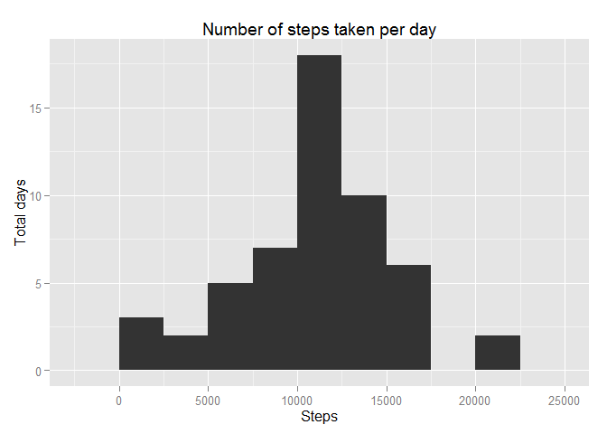
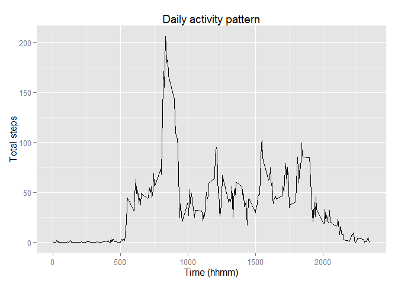
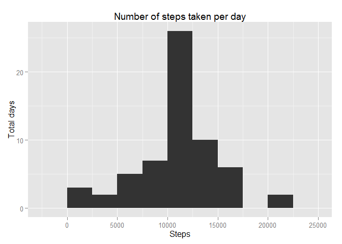
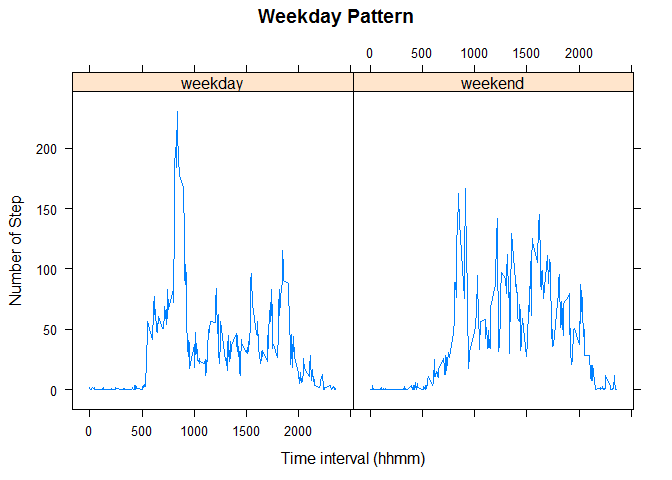

# Reproducible Research: Peer Assessment 1


## Loading and preprocessing the data

Firstly, the data is loaded without further preprocessing.

```r
data <- read.csv(file = "activity.csv")
```

## What is mean total number of steps taken per day?

Second, the missing values are ignored in this part. By using ggplot and aggregate, the total number of steps taken per day  
is calculated.

```r
library(ggplot2)
data1 <- data[!is.na(data$steps),]
total.step <- aggregate(data1$steps, by = list(data1$date), FUN = sum)
m <- ggplot(total.step, aes(x = x))
m + geom_histogram(binwidth = 2500) + 
    labs(x = "Steps", y = "Total days", 
         title = "Number of steps taken per day") 
```

 

```r
datasum <- summary(total.step$x)
```

Then the mean and median are calculated.

```r
datasum[4] ;datasum[3]
```

```
##  Mean 
## 10770
```

```
## Median 
##  10760
```

## What is the average daily activity pattern?

Next, the daily activity pattern are calculated and plot.

```r
interval.step <- aggregate(data1$steps,
                by = list(data1$interval), FUN = mean)
m <- ggplot(interval.step, aes(x = Group.1, y = x))
m + geom_line() + 
    labs(x = "Time (hhmm)", y = "Total steps",  
         title = "Daily activity pattern") 
```

 

The maximum number of steps appears when the time is:

```r
interval.step[which(interval.step[, 2] == max(interval.step[, 2])), 1]
```

```
## [1] 835
```

## Imputing missing values
In this part, the missing values are replaced by the mean with corresponding interval.


```r
missingval <- nrow(data[is.na(data$steps),])
missrow <- which(is.na(data$steps))
manidata <- data
for (i in missrow) {
  inter <- which(interval.step[, 1] == data[i, 3])
  manidata[i, 1] <- interval.step[inter, 2] 
}

mani.tstep <- aggregate(manidata$steps,
                        by = list(manidata$date), FUN = sum)
m <- ggplot(mani.tstep, aes(x = x))
m + geom_histogram(binwidth = 2500) + 
    labs(x = "Steps", y = "Total days", 
         title = "Number of steps taken per day") 
```

 

Also, the mean and median are calculated.

```r
mani.datasum <- summary(mani.tstep$x)
mani.datasum[4]
```

```
##  Mean 
## 10770
```

```r
mani.datasum[3]
```

```
## Median 
##  10770
```

## Are there differences in activity patterns between weekdays and weekends?
In the last part, the data are analyzed by weekday and weekend. First, a new variable of weekday is created. Then a factor which indicates the weekday or weekend is added. Then the daily average steps are analyzed in seperated two groups: weekday and weekend.


```r
library(lattice)
```

```
## Warning: package 'lattice' was built under R version 3.2.2
```

```r
week.data <- cbind(manidata, weekdays(as.Date(
                   data[, 2], origin = paste(data[,2]))))
week.data <- cbind(week.data, 
                   factor(week.data[, 4], 
                          levels = c("Monday", "Tuesday", "Wednesday",
                                     "Thursday", "Friday", "Saturday",
                                     "Sunday"), 
                          labels = c("weekday", "weekday", "weekday",
                                     "weekday", "weekday", "weekend",
                                     "weekend")))
```

```
## Warning in `levels<-`(`*tmp*`, value = if (nl == nL) as.character(labels)
## else paste0(labels, : duplicated levels in factors are deprecated
```

```r
names(week.data)[c(4, 5)] <- c("Day", "Weekend")
wend <- week.data[week.data$Weekend == "weekend",]
wday <- week.data[week.data$Weekend == "weekday",]
wday.step <- aggregate(wday$steps, 
                       by = list(wday$interval), FUN = mean)
wend.step <- aggregate(wend$steps, 
                       by = list(wend$interval), FUN = mean)

wday.step <- cbind(wday.step, "weekday")
wend.step <- cbind(wend.step, "weekend")
names(wday.step) <- c("Interval", "Step", "Weekday")
names(wend.step) <- c("Interval", "Step", "Weekday")
week.step <- rbind(wday.step, wend.step)
xyplot(Step ~ Interval | Weekday, data = week.step, type = "l",
       xlab = "Time interval (hhmm)",
       ylab = "Number of Step", main = "Weekday Pattern")
```

 
